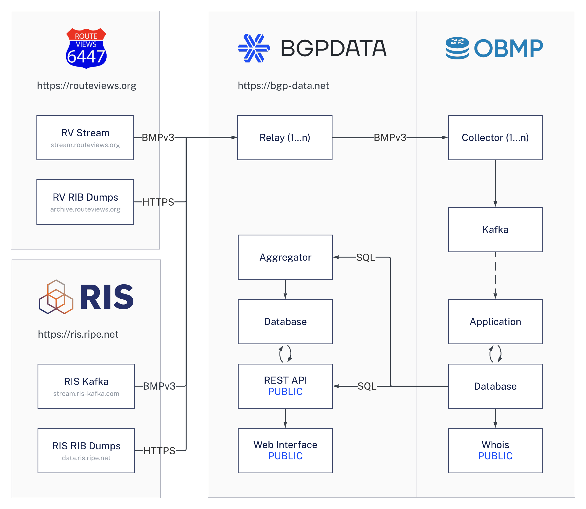

<br />
<br />

---

[https://bgp-data.net](https://bgp-data.net/?ref=github) — BGP Data Collection and Analytics Service

BGPDATA helps researchers and network operators gain insights into their networks by providing a scalable and reliable way to analyze and inspect historical and live BGP data from [Route Views](https://www.routeviews.org/) and [RIPE NCC RIS](https://ris.ripe.net/).

## Data Flow
We collect both historical and live BGP data from [Route Views](https://www.routeviews.org/) and [RIPE NCC RIS](https://ris.ripe.net/) collectors to provide comprehensive insights. 



## Prerequisites

Before you begin, ensure you have the following installed on your system:

-   [Docker](https://docs.docker.com/get-docker/)
-   [Docker Compose](https://docs.docker.com/compose/install/)
-   [Git](https://git-scm.com/book/en/v2/Getting-Started-Installing-Git)
-   [Jinja2 CLI](https://github.com/mattrobenolt/jinja2-cli)

## Getting Started

1. Clone the repository:
```bash
git clone git@github.com:bgpdata/bgpdata.git
cd bgpdata
```

2. Define a `.env` file:
```
FLASK_HOST=https://bgp-data.net
POSTMARK_API_KEY=your-postmark-api-key
CLOUDFLARE_TUNNEL_TOKEN=your-cloudflare-tunnel-token
GRAFANA_ADMIN_PASSWORD=your-grafana-admin-password
SECRET_KEY=your-flask-secret-key
```

3. Start the service:
```sh
jinja2 docker-compose.jinja values.yaml | docker compose -f - up
```

> **Note:** This will start collecting from all RouteViews and RIS Collectors. You can further specify to collect from only a specific subset of collector hosts by modifying the `values.yaml` file`.

4. Open:
http://localhost:8080 (Web)
http://localhost:3000 (Grafana)

### Production Deployment

For production deployment, we use Docker Swarm, but any other orchestration tool may be used.
The recommended system requirements are a minimum of 32 GB of RAM and 48 vCPU cores.

```sh
# Create an .env file as above, then:
curl -fsSL https://downloads.bgp-data.net/docker-compose.yml | docker stack deploy -c - bgpdata
```

# ACKs

-   [RIS](https://ris.ripe.net/) for providing the data and collector infrastructure
-   [Route Views](https://www.routeviews.org/) for providing the data and collector infrastructure
-   [OpenBMP](https://www.openbmp.org/) for providing the invaluable OpenBMP Suite used in-depth in this project
-   [Tim Evens](https://github.com/TimEvens) for his leading role in the development of the OpenBMP Suite
-   [RIPEstat](https://stat.ripe.net/) for their incredible infrastructure and data visualization
-   [RIPE Atlas](https://atlas.ripe.net/) for providing the RIPE Atlas infrastructure and providing mesaurement data for this project
-   [Massimo Candela](https://www.linkedin.com/in/massimocandela) for his outstanding work on [BGPlay](https://bgplayjs.com/)
-   [Christian Teuschel](https://www.linkedin.com/in/cteuschel/) for his inspiration for this project and operation of RIPEstat at the RIPE NCC
-   [Ben Cartwright-Cox](https://benjojo.co.uk/) for the development of [BGP.tools](https://bgp.tools/) and service to the Internet Community
-   [CAIDA BGPStream](https://bgpstream.caida.org/) for providing a versatile BGP data streaming library
-   [Postmark](https://postmarkapp.com/) for providing the email service

## License

See [LICENSE](LICENSE)
